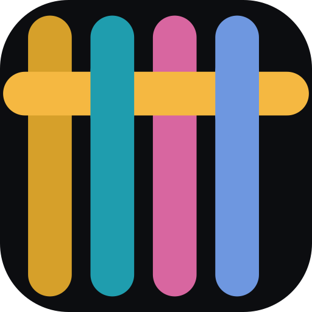
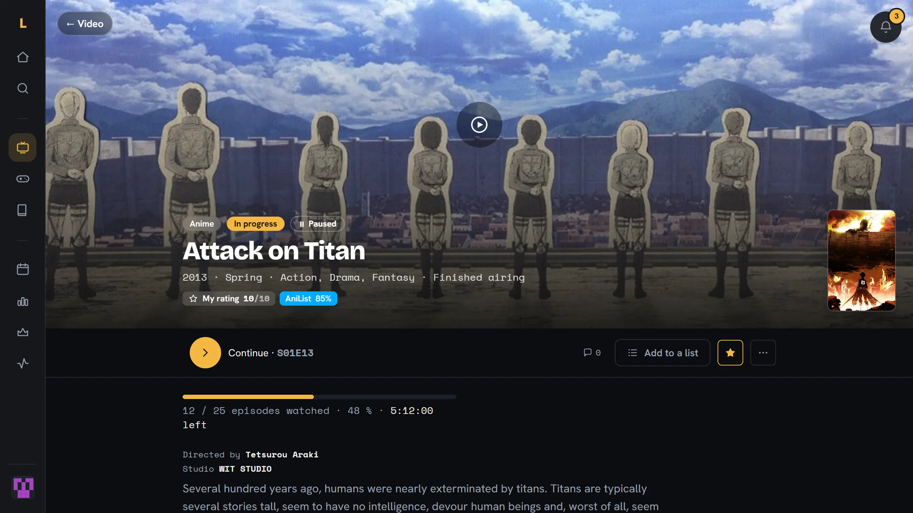

<p align="center">
  
</p>

<h1 align="center">Loomkeep</h1>

<p align="center">
  Track your series, films, anime, games, books and music in one place.<br>
  Open source, ad-free, on <a href="https://loomkeep.app">loomkeep.app</a> or on your own server.
</p>

<p align="center">
  <a href="https://loomkeep.app"><strong>Open Loomkeep</strong></a> ·
  <a href="https://docs.loomkeep.app"><strong>Documentation</strong></a> ·
  <a href="https://docs.loomkeep.app/api/reference/">API reference</a> ·
  <a href="https://feedback.loomkeep.app">Feedback</a> ·
  <a href="https://status.loomkeep.app">Status</a>
</p>

<p align="center">
  <a href="https://github.com/Logan2234/loomkeep/actions/workflows/ci.yml"></a>
  <a href="https://codecov.io/gh/Logan2234/loomkeep"></a>
  <a href="https://github.com/Logan2234/loomkeep/actions/workflows/codeql.yml"></a>
  <a href="https://scorecard.dev/viewer/?uri=github.com/Logan2234/loomkeep"></a>
  <a href="https://stats.uptimerobot.com/3nvxkigZ8T"></a>
  <a href="CHANGELOG.md"></a>
  <a href="LICENSE"></a>
</p>



## What it does

- **Six kinds of media, one library**: films, series and anime from TMDB and
  AniList, games from IGDB, books from Open Library, music from MusicBrainz.
- **Every viewing counts**: each episode, rewatch, play session and reread
  is kept and dated, for a real history and honest stats.
- **Bring your history**: imports from TV Time, Trakt, Simkl, MyAnimeList,
  Steam, Goodreads, StoryGraph and Babelio.
- **Yours to script**: a read-only public API with personal keys, and
  calendar and feed links.
- **Yours to host**: the same code as loomkeep.app, in two Docker images.
  Social features, achievements and sign-ups are switches you control.

Built as a TV Time replacement you fully own. Installable on your phone as
an app.

## Run your own

```sh
git clone https://github.com/Logan2234/loomkeep.git && cd loomkeep
cp .env.example .env   # then fill in the required values
docker compose -f docker/docker-compose.yml up -d
```

Then open <http://localhost:8080>. The
[installation guide](https://docs.loomkeep.app/self-hosting/installation/)
lists the values `.env` needs; the rest of the
[self-hosting guide](https://docs.loomkeep.app/self-hosting/) covers HTTPS
on your own domain, backups, upgrades and the optional services (monitoring,
error tracking, single sign-on…).

## Contribute

Ideas and bugs in the app go on [feedback.loomkeep.app](https://feedback.loomkeep.app);
problems running an instance in a [GitHub issue](https://github.com/Logan2234/loomkeep/issues/new/choose).
To work on the code, the [contributing guide](https://docs.loomkeep.app/project/contributing/)
sets up a development environment in a few commands, and
[Architecture](https://docs.loomkeep.app/project/architecture/) explains how
the pieces fit. Translations are welcome too:
[Translating](https://docs.loomkeep.app/project/translating/).

Found a vulnerability? Report it privately: see [SECURITY.md](SECURITY.md).

## Support

Loomkeep is made and hosted by one person, without ads or investors.
Donations pay for the server:

[](https://www.buymeacoffee.com/loomkeep)
[](https://ko-fi.com/loomkeep)
[](https://github.com/sponsors/Logan2234)
[](https://liberapay.com/loomkeep/donate)

## License

[AGPL-3.0](LICENSE): use it, change it, host it for others. If you run a
modified version for other people, share your changes with them.

Except the `ee/` directories (`apps/api/src/ee`, `apps/web/src/lib/ee`),
under a [commercial license](LICENSE-EE): the premium features, whose code is
public but which take a license key in production once premium launches.
Until then, they are on for everyone. Details:
[License](https://docs.loomkeep.app/project/license/).
